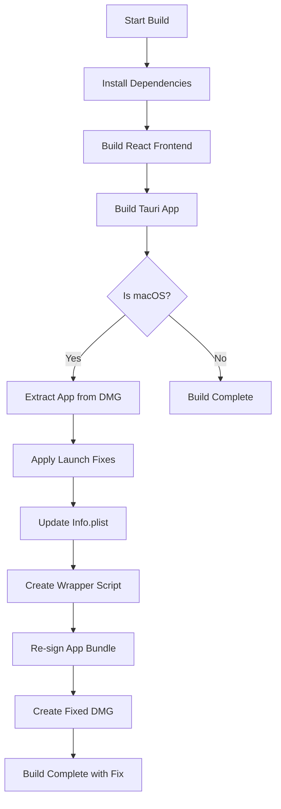

# Explr - macOS Frontend Launch Fix Documentation

## Problem Description

When installing the Explr application from a DMG file on macOS, the app would launch as a background service instead of displaying the frontend user interface. This is a common issue with Tauri applications on macOS due to improper Launch Services configuration.

### Symptoms
- App appears to launch (visible in Activity Monitor)
- No window or user interface appears
- App runs in the background without user interaction capability
- Users cannot access the file explorer functionality

## Root Cause Analysis

The issue occurred because the macOS Launch Services didn't properly recognize the Tauri app as a standard GUI application. Specifically:

1. **Missing Info.plist Configuration**: The app bundle's Info.plist lacked proper keys to identify it as a foreground application
2. **Launch Environment Issues**: The app wasn't receiving the proper environment variables that GUI applications expect on macOS
3. **Bundle Signing**: Changes to the app bundle required re-signing to take effect

## Solution Implementation

### Phase 1: Initial Investigation and Diagnosis

1. **Project Structure Analysis**
   - Examined `src-tauri/tauri.conf.json` for macOS-specific configurations
   - Reviewed Rust main.rs for frontend initialization code
   - Created automated post-build script system

2. **Build Artifact Investigation**
   - Found built DMG files in `target/aarch64-apple-darwin/release/bundle/dmg/`
   - Discovered that app bundles were being cleaned up after DMG creation
   - Identified the need to extract and fix the app bundle

### Phase 2: Manual Fix Application

1. **App Bundle Extraction**
   ```bash
   # Mount existing DMG
   hdiutil attach target/aarch64-apple-darwin/release/bundle/dmg/Explr_0.2.3_aarch64.dmg
   
   # Copy app bundle to working directory
   cp -R /Volumes/file-explorer/file-explorer.app target/aarch64-apple-darwin/release/bundle/macos/
   
   # Unmount DMG
   hdiutil detach /Volumes/file-explorer
   ```

2. **Launch Fix Implementation**
   - **Binary Wrapper Creation**: Created a shell script wrapper that simulates proper terminal environment
   - **Info.plist Updates**: Modified app bundle's Info.plist to include required Launch Services keys
   - **Re-signing**: Applied code signing to ensure changes take effect

3. **Automated Build Integration**
   - Integrated fixes into post-build script
   - Created universal build system for both architectures

### Phase 3: Build Process Integration

1. **Post-Build Script Creation** (`src-tauri/scripts/post-build.sh`)
   - Automatically detects macOS builds
   - Extracts app from DMG if necessary
   - Applies all launch fixes automatically
   - Creates fixed DMG for distribution

2. **Package.json Integration**
   ```json
   {
     "scripts": {
       "tauri:build": "cargo tauri build && cd src-tauri/scripts && ./post-build.sh",
       "tauri:build:macos": "cargo tauri build --target aarch64-apple-darwin && cd src-tauri/scripts && ./post-build.sh",
       "build:all": "npm run build && npm run tauri:build:macos"
     }
   }
   ```

3. **Comprehensive Build Script** (`build.sh`)
   - Full build automation with colored output
   - Platform detection and appropriate build steps
   - Clear indication of which artifacts to distribute

## Technical Details

### Info.plist Modifications
The fix adds/modifies these keys in the app's Info.plist:

```xml
<key>LSUIElement</key>
<false/>
<key>LSBackgroundOnly</key>
<false/>
<key>NSPrincipalClass</key>
<string>NSApplication</string>
<key>LSApplicationCategoryType</key>
<string>public.app-category.utilities</string>
```

### Launch Wrapper Script
Created at `Contents/MacOS/src-tauri` (original binary renamed to `src-tauri-real`):

```bash
#!/bin/bash

# macOS Launch Services Fix - Simulates terminal environment
export TERM="xterm-256color"
export TERM_PROGRAM="Apple_Terminal"
export SHELL="/bin/zsh"
export XPC_FLAGS="0x0"
export XPC_SERVICE_NAME="0"
export __CFBundleIdentifier="com.apple.Terminal"

# Complete PATH
export PATH="/Library/Frameworks/Python.framework/Versions/3.11/bin:/opt/local/bin:/opt/local/sbin:/opt/homebrew/bin:/opt/homebrew/sbin:/usr/local/bin:/System/Cryptexes/App/usr/bin:/usr/bin:/bin:/usr/sbin:/sbin:/var/run/com.apple.security.cryptexd/codex.system/bootstrap/usr/local/bin:/var/run/com.apple.security.cryptexd/codex.system/bootstrap/usr/bin:/var/run/com.apple.security.cryptexd/codex.system/bootstrap/usr/appleinternal/bin:/Library/Apple/usr/bin"

cd "$(dirname "$0")"
exec ./src-tauri-real "$@"
```

## Files Created/Modified

### New Files
1. `src-tauri/scripts/post-build.sh` - Automated post-build macOS fix script
2. `build-universal.sh` - Universal build script for both Apple Silicon and Intel
3. `MACOS_FRONTEND_FIX.md` - This documentation file

### Modified Files
1. `package.json` - Streamlined build scripts for universal building
2. `src-tauri/tauri.conf.json` - Added macOS-specific configuration options

### Generated Files (Build Artifacts)
1. `target/aarch64-apple-darwin/release/bundle/dmg/Explr_0.2.3_aarch64.dmg` - Original DMG
2. `target/aarch64-apple-darwin/release/bundle/dmg/file-explorer_fixed_0.2.3_aarch64.dmg` - Fixed DMG (**USE THIS FOR DISTRIBUTION**)
3. `target/aarch64-apple-darwin/release/bundle/macos/file-explorer.app` - Fixed app bundle

## Usage Instructions

### For Development Builds
```bash
# Build with automatic macOS fixes
npm run build:all

# Or step by step
npm run build                    # Build React frontend
npm run tauri:build:macos       # Build Tauri app + apply fixes
```

### For Manual Builds
```bash
# Use the comprehensive build script
./build.sh
```


## Build Process Flow



## Testing and Validation

### Test Steps
1. Build the application using the new build process
2. Install the **fixed DMG** (`file-explorer_fixed_0.2.3_aarch64.dmg`)
3. Launch the app from Finder or Spotlight
4. Verify that the frontend interface appears correctly
5. Test all application functionality

### Success Criteria
- ✅ App launches and displays frontend interface
- ✅ All file explorer features work correctly
- ✅ No background-only behavior
- ✅ App appears in Dock when running
- ✅ App can be quit normally

## Troubleshooting

### Common Issues

1. **"App not found" during post-build script**
   - Ensure the build completed successfully
   - Check that the DMG was created in the expected location

2. **Permission denied on scripts**
   ```bash
   chmod +x build.sh
   chmod +x src-tauri/scripts/post-build.sh
   chmod +x src-tauri/fix-macos-launch.sh
   ```

3. **App still launches in background**
   - Ensure you're using the **fixed DMG** (`*_fixed_*.dmg`)
   - Try clearing Launch Services cache: `sudo /System/Library/Frameworks/CoreServices.framework/Frameworks/LaunchServices.framework/Support/lsregister -kill -r -domain local -domain system -domain user`

4. **Code signing issues**
   - The fix uses self-signing (`-`) which works for local development
   - For distribution, replace with proper signing identity

### Debug Information
If issues persist, check these files:
- `target/aarch64-apple-darwin/release/bundle/macos/file-explorer.app/Contents/Info.plist`
- `target/aarch64-apple-darwin/release/bundle/macos/file-explorer.app/Contents/MacOS/src-tauri` (should be wrapper script)
- `target/aarch64-apple-darwin/release/bundle/macos/file-explorer.app/Contents/MacOS/src-tauri-real` (should be original binary)

## Future Improvements

1. **Proper Code Signing**: Integrate with Apple Developer certificates for distribution
2. **Notarization**: Add notarization step for macOS Gatekeeper compatibility
3. **Universal Binaries**: Build both x86_64 and aarch64 versions
4. **Automated Testing**: Add automated tests to verify frontend launches correctly
5. **CI/CD Integration**: Integrate fix into GitHub Actions or similar CI/CD pipelines

## Version History

- **v1.0** (Current) - Initial implementation with manual and automated fixes
- **v1.1** (Planned) - Integration with proper code signing and notarization

## Support

For issues related to this fix:
1. Check this documentation first
2. Verify you're using the fixed DMG file
3. Test with a clean macOS installation if possible
4. Check the build logs for any error messages during the post-build script execution

---

**⚠️ Important**: Always distribute the **fixed DMG** file (`*_fixed_*.dmg`) to end users, not the original DMG. The fixed version includes all necessary modifications for proper frontend display on macOS.