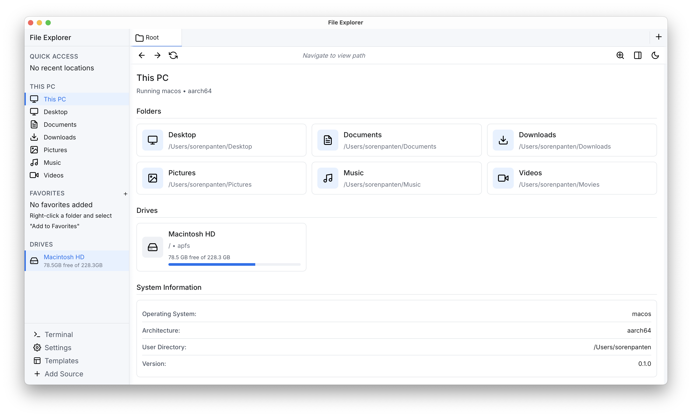
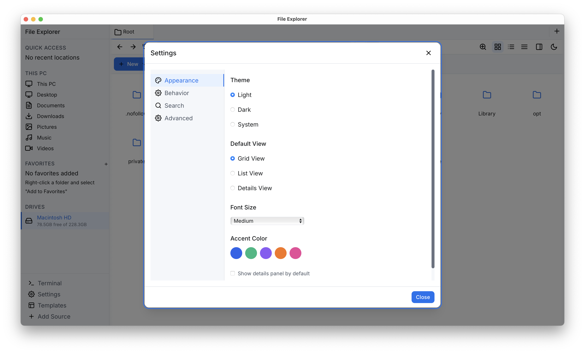

<div align="center">

# 🚀 Fast File Explorer


  
[](https://www.gnu.org/licenses/gpl-3.0)

**A fast file explorer built with Rust and Tauri**



</div>

## 🔍 Current Status

Cross platform compatibility is given and it supports all common Linux distros, which are supported
by Tauri. If there is an interest of contributing feel free to join the
[discord channel](https://discord.com/invite/dnVJQtNXjr) from Connaticus or message me or my team.

## Coming Soon

- Caching service with real-time file watching
- Search/caching progress indicator
- A better terminal emulator (maybe it is possible to have the systems default terminal integrated)

# 🛠️ Installation

Our plan is to provide installers for the supported operating systems or common package installers.
Unfortunately we have serious Problems with Tauri and creating installers. There are some installers
for linux under `dist-builds`. In the future there will be ready to go packages for macOS, Linux and
Windows until then please refer to the compilation from source for your computer.

## Installation from source

### Prerequisites for installing from source

- [NodeJS](https://nodejs.org/) (stable version)
- [Rust](https://www.rust-lang.org/) (stable version)
- [Tauri CLI](https://tauri.app/v1/guides/getting-started/prerequisites/) (version >2.4.0)
- [Cargo](https://doc.rust-lang.org/cargo/getting-started/installation.html) (comes with Rust)
- [Vite](https://vitejs.dev/guide/#scaffolding-your-first-vite-project) (comes with Tauri CLI)

Other required dependencies are installed automatically by the Tauri CLI. If they are not please
contact us.

### Install with compiling from source

Note that on macOS you need XCode installed with the build tools.

```bash
# Install Tauri CLI
cargo install tauri-cli # The version should be >2.4.0 if not already installed

# Build for production
cargo tauri build
```

Go into the build directory and run the created binary. The binary is located in
`FileExplorer/src-tauri/target/release/bundle/`. The name of the binary is `file-explorer` or

### 🐧 Linux

Under Linux the given command generates an `.deb`, `.rpm`, `AppImage` in the
`FileExplorer/src-tauri/target/release/bundle` folder. Select the one which fits your distribution.
Either run the AppImage, Binary or install the `.deb` or `.rpm` package.

#### For the `AppImage`

```bash
#Make sure the image is runnable
chmod +x yourapp-x.y.z.AppImage
#Run the image. After that it should behaving like a native application
./yourapp-x.y.z.AppImage
```

Recommended is to use the binary created in `FileExplorer/src-tauri/target/release/src-tauri`. Give
it executable permissions and then run it from the terminal. You can also put it into your user
binaries folder, e.g. `~/bin`, and add it to your PATH variable.

### 🍎 macOS

```bash
# Install Tauri CLI
cargo install tauri-cli # The version should be >2.4.0 if not already installed

# Build for production
cargo tauri build
```

Tauri creates an `.dmg` or `.app` bundle under the folder
`FileExplorer/src-tauri/target/release/bundle/macos/`. Recommended is to use the binary created in
`FileExplorer/src-tauri/target/release/src-tauri`. Give it executable permissions and then run it
from the terminal. You can also put it into your user binaries folder, e.g. `~/bin`, and add it to
your PATH variable.

### 🪟 Windows

This generates an installer for your system, which lays in
`FileExplorer/src-tauri/target/release/bundle/msi/`. There should be an `.exe` or `.msi` which is
called `file-explorer`. To install it you need to double click the file and install like any other
application. Then you can completely remove the `FileExplorer` folder.

### Development Setup

```bash
# Install Tauri CLI
cargo install tauri-cli # The version should be >2.4.0

# Build for production
cargo tauri build

# Run the development server
cargo tauri dev
```

## 📸 Images

<div align="center">



</div>

## 📄 History

The Explorer was started as a project from the youtuber
[Connaticus](https://www.youtube.com/@conaticus). He documented parts of his development journey
online in two Videos:
[I Made a FAST File Explorer](https://youtu.be/Z60f2g-COJY?si=PHWogkV1R_wD8dza) and
[How I RUINED My Rust Project](https://youtu.be/4wdAZQROc4A?si=9ksfN2TcxdDI41BD).

Lots of changes were made in the course of the InformatiCup from the year 2025. It is a competition
in Germany. The given task was to contribute to existing open source projects. The team members were
[Marco Brandt](https://github.com/CodeMarco05), [Daniel Schatz](https://github.com/xd1i0),
[Lauritz Wiebusch](https://github.com/wielauritz), [Sören Panten](https://github.com/SPKonig). The
repo can be found under [FileExplorer](https://github.com/CodeMarco05/FileExplorer).

## ⚡ Performance

Our benchmarks show extraordinary performance improvements over native solutions, based on 170
thousand paths:

| Operation   | Fast File Explorer | Windows Explorer |
| ----------- | :----------------: | :--------------: |
| File search |        ~2ms        |   (3min 45sec)   |

## 🤝 Contributing

Contributions are welcome! Before contributing, please read our
[contributing guidelines](CONTRIBUTING.md).

## 📝 License

This project is licensed under the GNU General Public License v3.0 – see the LICENSE file for
details.

## 📬 Contact

Have questions or feedback? Open an issue on our GitHub repository!
