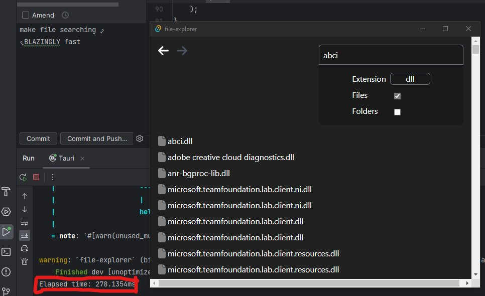

[](https://github.com/conaticus/FileExplorer/actions/workflows/rust.yml)

# Fast File Explorer
This is a fast file explorer written in Rust. After testing on my C drive, this file explorer was able to find a file in 280ms. In comparison, Windows took 3 minutes and 45 seconds.

Before contributing please read the [contributing guidelines](./CONTRIBUTING.md).

## Supported operating systems
- Windows

There are some issues with Linux and Mac but we shall work on these soon.

Bear in mind this is still in development and missing the following core features:
- Caching service (constant file watching to keep cache up to date) - only works when program is open
- Top navigation bar
- Search/caching progress counter
- Ability to search for file extensions without including any name
- Ability to copy/cut/paste files
- Ability to move files
- Ability to create files



# Dev Setup/Installation
## Prerequisites
- Stable [NodeJS](https://nodejs.org/) Install
- Stable [Rust](https://www.rust-lang.org/) Install
- Yarn installation (`npm i -g yarn`)

## Steps
```
#  Make sure you have Tauri CLI installed
cargo install tauri-cli

# Install dependencies
yarn

# Run app for development
cargo tauri dev

# Build for production
cargo tauri build
```
