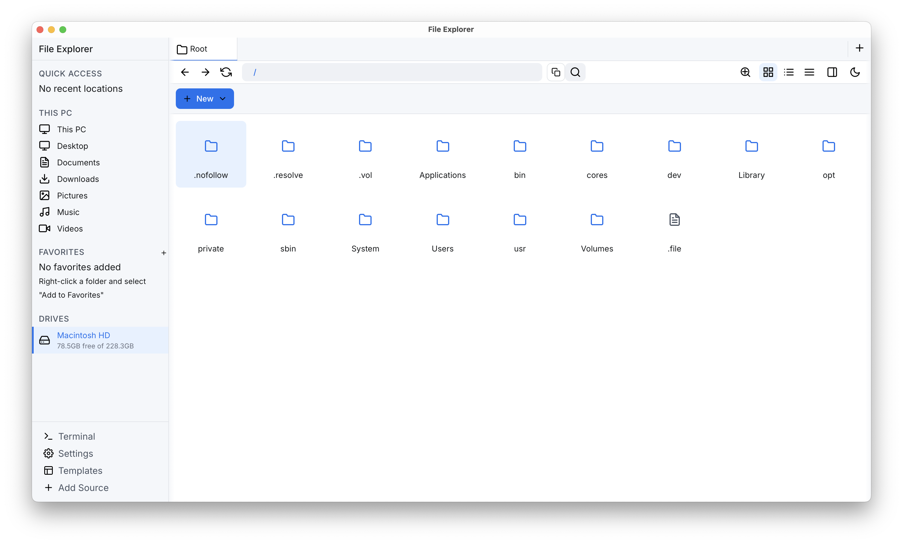
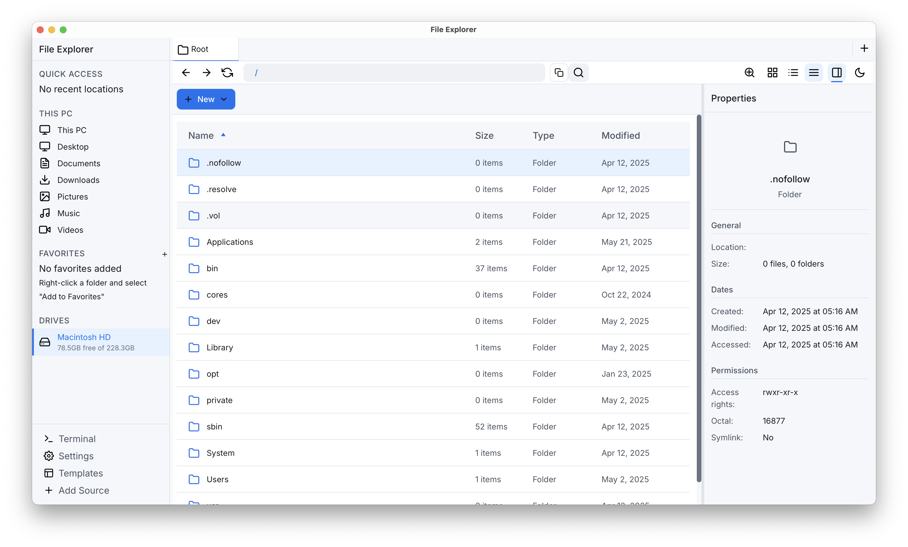

<div align="center">

# 🚀 Fast File Explorer


  
[](https://www.gnu.org/licenses/gpl-3.0)

**A fast file explorer built with Rust and Tauri**






</div>

## 🔍 Current Status

Cross platform compatibility is given and it supports all common Linux distros, which are supported
by Tauri. If there is an interest of contributing feel free to join the
[discord channel](https://discord.com/invite/dnVJQtNXjr) from Connaticus.

## Coming Soon

- Caching service with real-time file watching
- Search/caching progress indicator
- A better terminal emulator (maybe it is possible to have the systems default terminal integrated)

# 🛠️ Installation

For the installation there are packages provided with the current stable version. If there are no
packages for your system you can compile the Explorer from source with the given instructions.

## Installation from source

### Prerequisites for installing from source

- [NodeJS](https://nodejs.org/) (stable version)
- [Rust](https://www.rust-lang.org/) (stable version)

### Install with compiling from source

Note that on macOS you need XCode installed with the build tools.

```bash
# Install Tauri CLI
cargo install tauri-cli # The version should be >2.4.0

# Build for production
cargo tauri build
```

After that you need to follow the instructions for your operating system because now the installer
for your system is created and you need to install the application.

### 🐧 Linux

Under Linux the given command generates an `.deb`, `.rpm`, `AppImage` in the
`FileExplorer/src-tauri/target/release/bundle` folder. From there on open the file and drag it into
the applications folder. Then it should be available.

#### For the `AppImage`

```bash
#Make sure the image is runnable
chmod +x yourapp-x.y.z.AppImage
#Run the image. After that it should behaving like a native application
./yourapp-x.y.z.AppImage
```

### 🍎 macOS

Tauri creates an `.dmg` or `.app` bundle under the folder
`FileExplorer/src-tauri/target/release/bundle/macos/`. Open the

### 🪟 Windows

This generates an installer for your system, which lays in
`FileExplorer/src-tauri/target/release/bundle/msi/`. There should be an `.exe` or `.msi` which is
called `file-explorer`. To install it you need to double click the file and install like any other
application. Then you can completely remove the `FileExplorer` folder.

### Development Setup

```bash
# Install Tauri CLI
cargo install tauri-cli # The version should be >2.4.0

# Run in development mode
cargo tauri dev

# Build for production
cargo tauri build
```

## 📄 History

The Explorer was started as a project from the youtuber
[Connaticus](https://www.youtube.com/@conaticus). He documented parts of his development journey
online in two Videos:
[I Made a FAST File Explorer](https://youtu.be/Z60f2g-COJY?si=PHWogkV1R_wD8dza) and
[How I RUINED My Rust Project](https://youtu.be/4wdAZQROc4A?si=9ksfN2TcxdDI41BD).

Lots of changes were made in the course of the InformatiCup from the year 2025. It is a competition
in Germany. The given task was to contribute to existing open source projects. The team members were
[Marco Brandt](https://github.com/CodeMarco05), [Daniel Schatz](https://github.com/xd1i0),
[Lauritz Wiebusch](https://github.com/wielauritz), [Sören Panten](https://github.com/SPKonig). The
repo can be found under [FileExplorer](https://github.com/CodeMarco05/FileExplorer).

## ⚡ Performance

Our benchmarks show extraordinary performance improvements over native solutions, based on 170
thousand paths:

| Operation   | Fast File Explorer | Windows Explorer |
| ----------- | :----------------: | :--------------: |
| File search |        ~5ms        |   (3min 45sec)   |

## 🤝 Contributing

Contributions are welcome! Before contributing, please read our
[contributing guidelines](CONTRIBUTING.md).

## 📝 License

This project is licensed under the GNU General Public License v3.0 – see the LICENSE file for details.

## 📬 Contact

Have questions or feedback? Open an issue on our GitHub repository!
